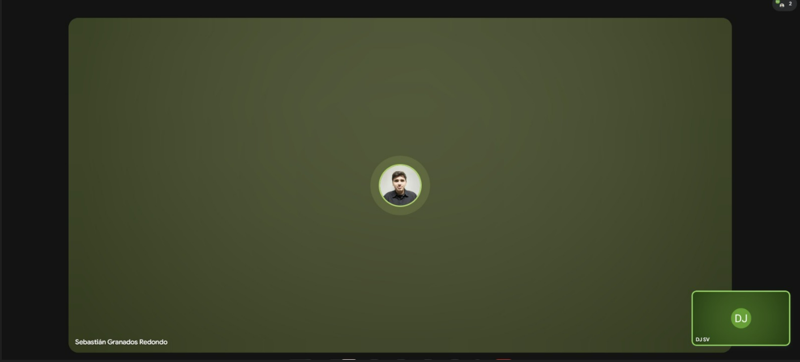

# Sesión : Propuesta de problema a solucionar: Ingeniería de Software
**IF-7100 | I Ciclo 2026**

---

## Información del Curso
* **Institución:** Universidad de Costa Rica
* **Carrera:** Informática Empresarial
* **Profesor:** MSc. Leonardo Camacho 📧 `jose.camacho@ucr.ac.cr`
* **Modalidad:** Presencial (Teórico / Práctico)

---

## Equipo de Trabajo
| Nombre del Estudiante | Carné | 
| :--- | :--- |
| Dennis Segura | C37483 | 
| Sebastian Granados | C23496 | 

---

## [12/3/2026] - Propuesta para problema

##  Propuesta para Gimnasio

### Esta propuesta busca automatizar la creación de rutinas de entrenamiento y planes de alimentación personalizados mediante el uso de IA, analizando datos clave como el peso, la experiencia previa y los objetivos específicos de cada usuario. El sistema ajustará las cargas y dietas de forma dinámica para adaptarse a las necesidades reales de cada persona, manteniendo siempre una supervisión humana para validar las recomendaciones y garantizar que el proceso sea seguro y equilibrado.

Actualmente, el gimnasio One Day Fit enfrenta dificultades para ofrecer rutinas de entrenamiento y planes de alimentación realmente personalizados a todas las personas que solicitan este servicio, debido al crecimiento en la cantidad de clientes y al tiempo que requiere analizar manualmente la información de cada persona.

En la actualidad, los entrenadores deben recopilar datos de cada cliente y elaborar recomendaciones de forma manual, lo cual puede generar procesos lentos, repetitivos y con limitaciones para atender a una mayor cantidad de personas. Además, muchas veces las rutinas y planes de alimentación terminan siendo similares entre distintos clientes, ya que no siempre se cuenta con el tiempo suficiente para realizar un análisis profundo de cada caso.

Esto provoca que algunas personas no reciban recomendaciones completamente ajustadas a sus características físicas, nivel de experiencia o metas personales, lo que puede afectar la efectividad del entrenamiento y la motivación del cliente.

### Procedimientos actuales:

1. Las personas interesadas en iniciar un programa de entrenamiento o mejorar su condición física en el gimnasio (llámense clientes) se acercan al establecimiento o se comunican con el personal del gimnasio para solicitar una rutina de entrenamiento o recomendaciones de alimentación.

2. Un entrenador del gimnasio solicita al cliente información básica como peso, estatura, edad, experiencia previa en entrenamiento, posibles lesiones y los objetivos que desea alcanzar, como por ejemplo perder peso, ganar masa muscular o mejorar su condición física.

3. El entrenador analiza manualmente la información proporcionada por el cliente y, con base en su experiencia y conocimiento, determina cuál podría ser la rutina de ejercicios y las recomendaciones alimenticias más adecuadas para esa persona.

4. Posteriormente, el entrenador crea la rutina de entrenamiento y las recomendaciones de alimentación, generalmente utilizando plantillas o modelos que ya ha utilizado anteriormente con otros clientes y adaptándolos según las características del caso.

5. Una vez finalizada la rutina, el entrenador la entrega al cliente, ya sea de forma verbal, en formato escrito o mediante un documento digital, explicando cómo debe realizar los ejercicios y qué recomendaciones debe seguir.

6. Con el paso del tiempo, si el cliente desea modificar sus objetivos o si el progreso requiere ajustes, el entrenador debe revisar nuevamente la información del cliente y realizar cambios manuales en la rutina o en las recomendaciones alimenticias.

### Captura de Evidencia
